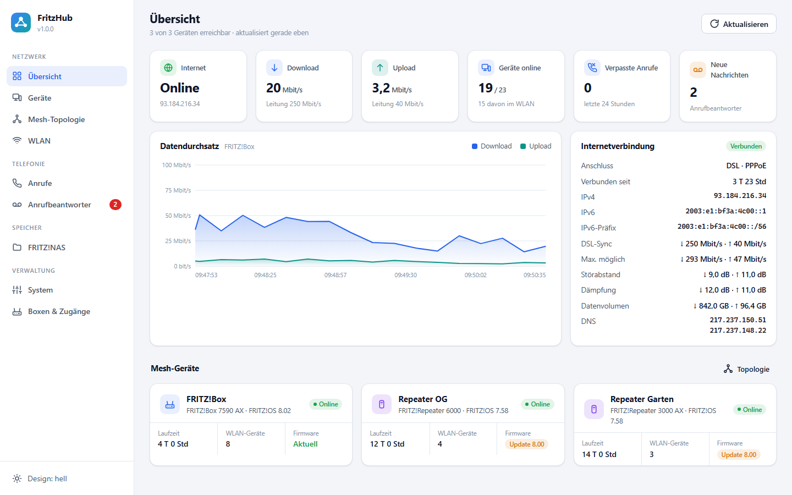
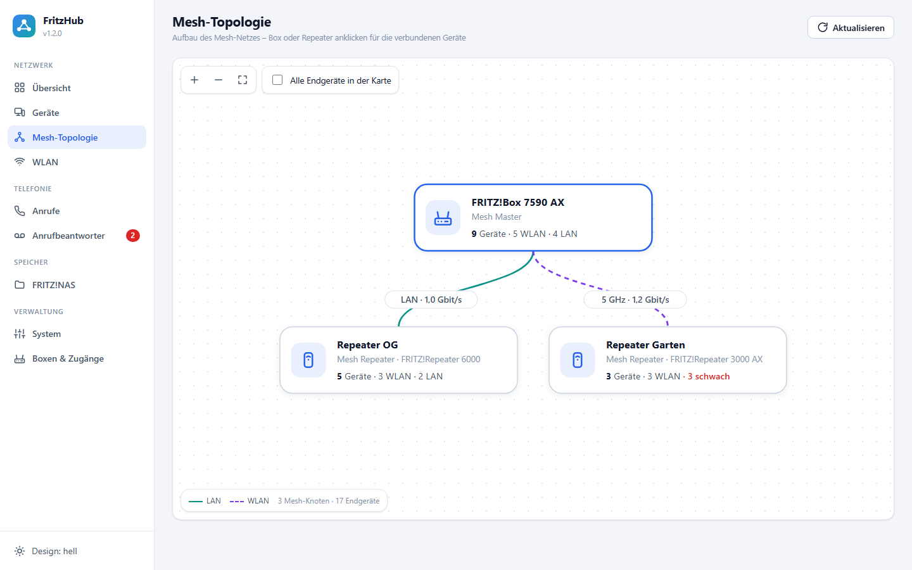
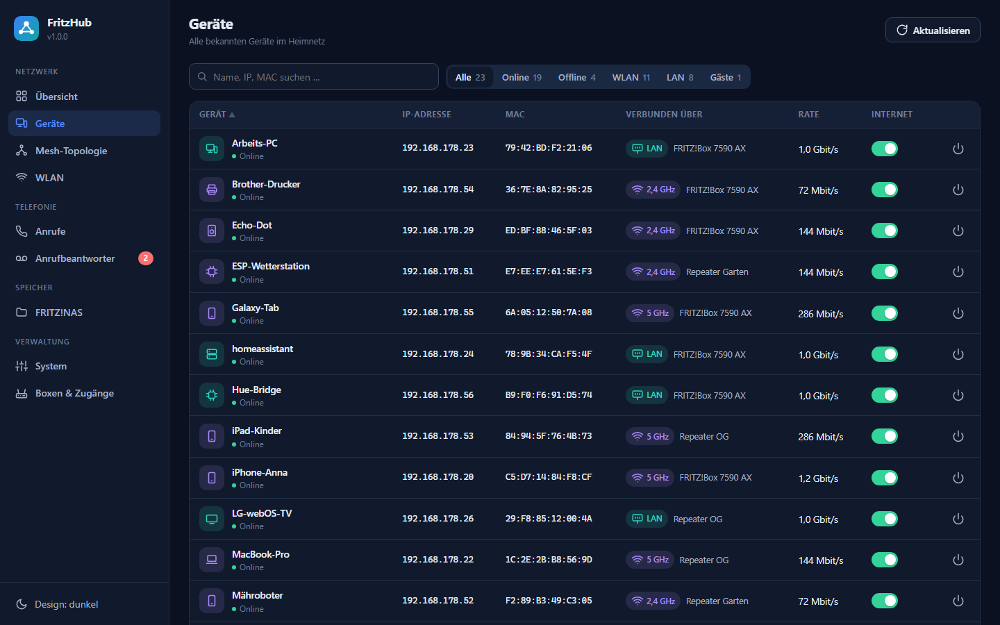
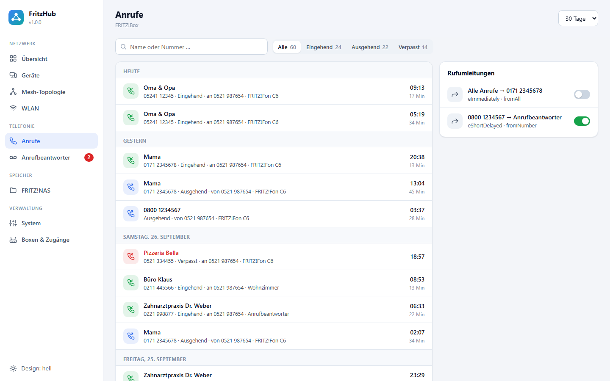
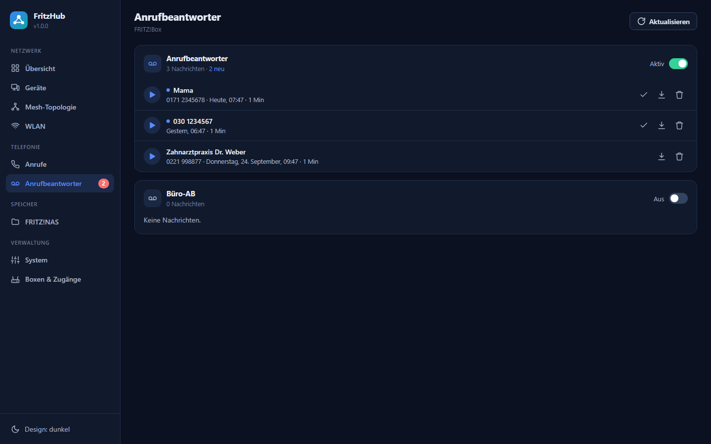

<p align="center">
  
</p>

<p align="center">
  <b>Das Dashboard für FRITZ!Box, FRITZ!Repeater und das ganze Mesh – direkt in Home Assistant.</b>
</p>

<p align="center">
  <a href="https://my.home-assistant.io/redirect/supervisor_add_addon_repository/?repository_url=https%3A%2F%2Fgithub.com%2FTelo87%2Fha-fritzhub"></a>
</p>

<p align="center">
  
  
  
</p>

<p align="center">
  🇩🇪 Deutsch · <a href="#english">🇬🇧 English</a>
</p>

---



## Funktionen

| | |
|---|---|
| 📊 **Übersicht** | Internetstatus, Durchsatz-Verlauf (1 Std / 24 Std / 7 Tage), **Datenvolumen pro Tag und Monat**, DSL-Werte (Sync, Störabstand, Dämpfung), IPv4/IPv6, Datenvolumen, Status aller Mesh-Geräte inkl. Firmware-Updates |
| 🕸️ **Mesh-Topologie** | Interaktive Karte (Zoomen, Verschieben, Details per Klick) mit Verbindungsart (LAN/WLAN, Band) und Geschwindigkeit jeder Strecke; **WLAN-Anbindung der Repeater** mit Signalstärke, Raten und Verlauf |
| 💻 **Geräte** | Alle Geräte im Heimnetz mit Suche, **Weboberflächen mit einem Klick öffnen**, **Umbenennen**, **Alarm bei neuen Geräten** (HA-Meldung / Push / Ereignis), Filtern (Online, WLAN, LAN, Gäste …), Zugangspunkt im Mesh, **WLAN-Signalstärke** inkl. Übersicht der schwächsten Verbindungen, **Internetzugang sperren/erlauben**, „Zuletzt gesehen“ zum Aufräumen alter Einträge |
| 📶 **WLAN** | **Kanalprüfung** mit Warnung bei Überschneidungen und Kanalvorschlag, alle Funknetze aller Boxen und Repeater, ein-/ausschalten, SSID und Passwort ändern, **QR-Code** zum Verbinden (ideal fürs Gastnetz) |
| 📞 **Anrufe** | Anrufliste mit Filtern und Suche, gruppiert nach Tagen; **Nummern sperren** (Rufsperre); Rufumleitungen ein-/ausschalten |
| 📼 **Anrufbeantworter** | Nachrichten direkt im Browser **abhören**, herunterladen, als gehört markieren, löschen; Anrufbeantworter ein-/ausschalten |
| 🗂️ **FRITZ!NAS** | Dateibrowser mit **Vorschau** (Bilder, PDF, Video, Audio, Text), Upload (Drag & Drop), Download, Ordner anlegen, Umbenennen und Löschen |
| ⚙️ **System** | Geräteinfos, Ereignisprotokoll, Neustart einzeln oder **aller Geräte mit einem Klick** (Repeater zuerst, Mesh Master zuletzt), Internetverbindung neu aufbauen |
| 🔎 **Automatische Suche** | Findet FRITZ!Boxen und Repeater per UPnP/SSDP und Subnetz-Scan |
| 🔐 **Mehrere Zugänge** | Jede Box/jeder Repeater mit eigenen Zugangsdaten – oder mit einem Klick von der FRITZ!Box übernehmen |
| 🏠 **HA-Sensoren** | Optional: Download/Upload, Internetstatus, externe IP, verpasste Anrufe, neue AB-Nachrichten, Geräte online |

Dazu: helles & dunkles Design, responsiv bis aufs Smartphone, keine externen Abhängigkeiten im Browser (funktioniert auch ohne Internet).

<table>
  <tr>
    <td></td>
    <td></td>
  </tr>
  <tr>
    <td></td>
    <td></td>
  </tr>
</table>

## Installation

1. Auf den Button **„Repository zu Home Assistant hinzufügen“** oben klicken – oder in Home Assistant unter
   **Einstellungen › Add-ons › Add-on-Store › ⋮ › Repositories** die URL
   `https://github.com/Telo87/ha-fritzhub` eintragen.
2. **FritzHub** installieren und starten.
3. **Web-UI öffnen** (oder „In Seitenleiste anzeigen“ aktivieren).
4. **Netzwerk durchsuchen** klicken, gefundene Geräte hinzufügen und Zugangsdaten eintragen – fertig.

## Vorbereitung der FRITZ!Box

| Einstellung | Wo in der FRITZ!Box |
|---|---|
| **TR-064 aktivieren** | Heimnetz › Netzwerk › Netzwerkeinstellungen › *Zugriff für Apps erlauben* (ältere FRITZ!OS: *Zugriff für Anwendungen zulassen*) |
| **Eigenen Benutzer anlegen** (empfohlen) | System › FRITZ!Box-Benutzer › *Benutzer hinzufügen* |
| **Rechte des Benutzers** | *FRITZ!Box Einstellungen*, *Sprachnachrichten, Faxnachrichten, FRITZ!App Fon und Anrufliste*, *Zugang zu NAS-Inhalten* |
| **FTP für FRITZ!NAS** (optional) | Heimnetz › Speicher (NAS) › *Heimnetzfreigabe* › *Zugriff über FTP aktiviert* |

### Mesh mit mehreren Geräten

Im Mesh liefert der **Mesh Master** (die FRITZ!Box) die Topologie und die Geräteliste. Repeater werden
zusätzlich einzeln hinzugefügt, damit ihr WLAN, ihre Laufzeit und ihr Firmware-Stand angezeigt und
gesteuert werden können. Jeder Repeater hat eigene Zugangsdaten – im Mesh ist das meist das Kennwort der
FRITZ!Box. Beim Hinzufügen kann man dafür **„Zugangsdaten übernehmen von …“** wählen.

## Home-Assistant-Sensoren

Ist `publish_sensors` aktiv, legt FritzHub u. a. diese Entitäten an (`<box>` = Name der Box):

- `binary_sensor.fritzhub_<box>_online`, `binary_sensor.fritzhub_<box>_internet`
- `sensor.fritzhub_<box>_download`, `sensor.fritzhub_<box>_upload` (Mbit/s)
- `sensor.fritzhub_<box>_external_ip`
- `sensor.fritzhub_<box>_missed_calls`, `sensor.fritzhub_<box>_voicemail`
- `sensor.fritzhub_devices_online`

Weitere Details stehen in der [Dokumentation](fritzhub/DOCS.md).

## Entwicklung

Die Oberfläche lässt sich ohne FRITZ!Box im **Demo-Modus** mit Beispieldaten starten:

```bash
cd fritzhub/rootfs/opt
pip install -r ../../requirements.txt
FRITZHUB_DEMO=1 FRITZHUB_ALLOW_ALL=1 FRITZHUB_DATA=/tmp/fritzhub python -m fritzhub
# → http://localhost:8099
```

Tests: `pip install pytest && pytest`

Aufbau:

```
fritzhub/                  Add-on (config.yaml, Dockerfile, Doku)
└─ rootfs/opt/fritzhub/
   ├─ box.py               TR-064-Zugriff auf eine Box (fritzconnection)
   ├─ hub.py               Polling, Cache, Verlauf, Mesh-Zusammenführung, HA-Sensoren
   ├─ discovery.py         SSDP + Subnetz-Scan
   ├─ nas.py               FRITZ!NAS über FTP(S), gestreamt
   ├─ audio.py             G.711 → PCM, damit AB-Nachrichten in jedem Browser laufen
   ├─ server.py            aiohttp REST-API + Ingress
   └─ static/              Single-Page-App (Vanilla JS, kein Build-Schritt)
```

## Hinweise

- Zugangsdaten werden ausschließlich lokal im Add-on-Datenverzeichnis (`/data/boxes.json`, nur für das Add-on lesbar) gespeichert.
- Die Oberfläche ist nur über Home Assistant (Ingress) erreichbar, obwohl das Add-on im Host-Netzwerk läuft.
- Dieses Projekt steht in keiner Verbindung zur FRITZ! GmbH (vormals AVM). FRITZ! und FRITZ!Box sind deren Marken.

## Lizenz

[MIT](LICENSE)

Einige Icons basieren auf [Lucide](https://lucide.dev) (ISC-Lizenz).

---

<a id="english"></a>

## 🇬🇧 English

**FritzHub** is a Home Assistant add-on (app) for **FRITZ!Box** routers and **FRITZ!Repeaters** – built for
mesh networks with several boxes and repeaters. The user interface is currently **German only**.

### Features

- **Dashboard** – internet status, throughput history (1 h / 24 h / 7 days), data volume per day and month,
  DSL values, status and firmware of every mesh device
- **Mesh topology** – interactive map with link type and speed; WLAN uplink quality of repeaters (signal, rates,
  history) and a warning for LAN links below 1 Gbit/s
- **Devices** – all devices with vendor detection (MAC), WLAN signal strength, weakest connections,
  "last seen", rename, block internet access, one-click links to the device's **web interface**
- **New device alarm** – Home Assistant notification, optional push (`notify.*`) and the event
  `fritzhub_new_device` for automations (can be switched off)
- **WLAN** – all networks of all boxes, QR code, guest network, **channel check** with suggestions
- **Phone** – call list, **block numbers**, call deflections, **answering machine** playback in the browser
- **FRITZ!NAS** – file browser with preview (images, PDF, video, audio, text), upload and download
- **System** – device info, event log, reboot single devices or **all at once** with live status
- **Auto discovery** of boxes and repeaters (SSDP + subnet scan), separate credentials per device

### Installation

1. Click **"Add repository"** at the top – or in Home Assistant go to **Settings › Add-ons › Add-on Store › ⋮ ›
   Repositories** and add `https://github.com/Telo87/ha-fritzhub`.
2. Install and start **FritzHub**, then open the web UI.
3. Click **"Netzwerk durchsuchen"** (scan network) and add your devices with their credentials.

**Requirements:** Home Assistant OS or Supervised on `amd64` or `aarch64`. In the FRITZ!Box enable
**TR-064** (*Heimnetz › Netzwerk › Netzwerkeinstellungen › Zugriff für Apps erlauben*). A dedicated FRITZ!Box
user with the rights *FRITZ!Box Einstellungen*, *Sprachnachrichten … und Anrufliste* and *Zugang zu NAS-Inhalten*
is recommended. For FRITZ!NAS, enable FTP access.

Credentials are stored only inside the add-on (`/data`). The UI is only reachable through Home Assistant
(ingress). Not affiliated with FRITZ! GmbH (formerly AVM).
